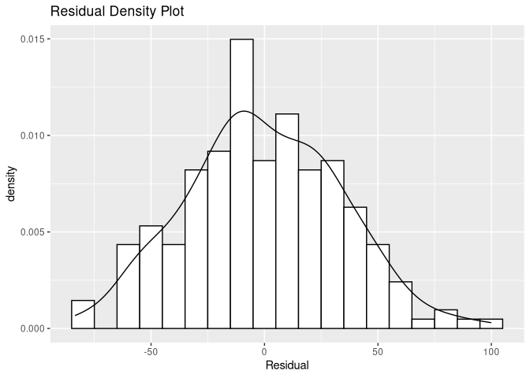

Results Analysis
================

First we will load the variables.

``` r
fit_summary <- summary(model_fit)$summary[, 'mean']
print(fit_summary[1:10])
```

    ## beta_intercept        beta[1]        beta[2]        beta[3]        beta[4] 
    ##   0.0003837441   0.0226591443  -0.2821666867   0.0731516305  -0.3869974305 
    ##        beta[5]        beta[6]        beta[7]        beta[8]        beta[9] 
    ##   0.0522970501  -0.0322341229   0.0674865334   0.1485237179  -0.0116077469

``` r
b0 <- fit_summary['beta_intercept']
beta <- fit_summary[startsWith(names(fit_summary), 'beta[')]
names(beta) <- player_stats_cols
print(beta)
```

    ##               Disposals                   Kicks                   Marks 
    ##              0.02265914             -0.28216669              0.07315163 
    ##               Handballs                   Goals                 Behinds 
    ##             -0.38699743              0.05229705             -0.03223412 
    ##                Hit.Outs                 Tackles                Rebounds 
    ##              0.06748653              0.14852372             -0.01160775 
    ##              Inside.50s              Clearances                Clangers 
    ##              0.24129088             -0.16825430             -0.59904225 
    ##                   Frees           Frees.Against          Brownlow.Votes 
    ##             -0.12494997              0.36771737              0.37053928 
    ##   Contested.Possessions Uncontested.Possessions         Contested.Marks 
    ##              0.36974425              0.47471299             -0.03848329 
    ##         Marks.Inside.50          One.Percenters                 Bounces 
    ##             -0.08878032              0.12374787              0.06940545 
    ##            Goal.Assists 
    ##              0.05074194

``` r
sigma_player <- fit_summary['sigma_player']
game_intercept <- fit_summary['alpha']
game_home <- fit_summary['beta_home']
game_away <- fit_summary['beta_away']
cat(c(game_home, game_away))
```

    ## 107.3925 132.1639

We can see the most important statistics in order:

``` r
beta[order(beta, decreasing=T)]
```

    ## Uncontested.Possessions          Brownlow.Votes   Contested.Possessions 
    ##              0.47471299              0.37053928              0.36974425 
    ##           Frees.Against              Inside.50s                 Tackles 
    ##              0.36771737              0.24129088              0.14852372 
    ##          One.Percenters                   Marks                 Bounces 
    ##              0.12374787              0.07315163              0.06940545 
    ##                Hit.Outs                   Goals            Goal.Assists 
    ##              0.06748653              0.05229705              0.05074194 
    ##               Disposals                Rebounds                 Behinds 
    ##              0.02265914             -0.01160775             -0.03223412 
    ##         Contested.Marks         Marks.Inside.50                   Frees 
    ##             -0.03848329             -0.08878032             -0.12494997 
    ##              Clearances                   Kicks               Handballs 
    ##             -0.16825430             -0.28216669             -0.38699743 
    ##                Clangers 
    ##             -0.59904225

Let us see who the best players are.

``` r
player_scores <- player_matrix %*% beta + b0
player_mean_data$score <- player_scores
players %>%
  merge(player_mean_data[c("playerId", "score")]) %>%
  arrange(desc(score)) %>%
  head(20)
```

    ##      playerId          displayName height weight         dob          position
    ## 1  2003874470         Watson, Jobe    191     93  8-Feb-1985          Midfield
    ## 2  2008672876       Cotchin, Trent    185     86  7-Apr-1990          Midfield
    ## 3  2002775293        Mitchell, Sam    180     84 12-Oct-1982          Midfield
    ## 4  2004837240       Stanton, Brent    183     82  1-May-1986          Midfield
    ## 5  2005682511       Deledio, Brett    188     88 18-Apr-1987 Midfield, Forward
    ## 6  2002652211         Ablett, Gary    182     87 14-May-1984           Forward
    ## 7  2012905229         Zorko, Dayne    175     78  9-Feb-1989          Midfield
    ## 8  2009664745         Beams, Dayne    187     88 12-Feb-1990          Midfield
    ## 9  2002749381          Judd, Chris    189     88  8-Sep-1983          Midfield
    ## 10 2010704250            Fyfe, Nat    192     96 18-Sep-1991 Midfield, Forward
    ## 11 2007714710         Grigg, Shaun    190     85 19-Apr-1988          Midfield
    ## 12 2003833172           Swan, Dane    185     93 25-Feb-1984          Midfield
    ## 13 2008681760 Dangerfield, Patrick    189     92  5-Apr-1990 Midfield, Forward
    ## 14 2008832831       Selwood, Scott    186     85 27-Mar-1990          Midfield
    ## 15 2009835778         Sloane, Rory    182     83 17-Mar-1990          Midfield
    ## 16 2005706701        Foley, Nathan    178     79  8-Sep-1985 Midfield, Forward
    ## 17 2001849962      Thompson, Scott    184     86 14-Mar-1983          Midfield
    ## 18 2007746814         Jack, Kieren    178     81 28-Jun-1987 Midfield, Forward
    ## 19 2007835833        Selwood, Joel    183     84 26-May-1988          Midfield
    ## 20 1999728913         Hayes, Lenny    186     84 14-Jan-1980          Midfield
    ##                 origin player_idx    score
    ## 1  Sandringham Dragons        982 2.484116
    ## 2     Northern Knights        492 2.433437
    ## 3       Eastern Ranges       1034 2.358724
    ## 4     Northern Knights        981 2.031998
    ## 5   Murray Bushrangers        824 1.990353
    ## 6      Geelong Falcons        715 1.827346
    ## 7           Broadbeach         69 1.685126
    ## 8            Southport        797 1.594137
    ## 9  Sandringham Dragons       1165 1.576623
    ## 10           Claremont        200 1.555501
    ## 11      North Ballarat        932 1.535817
    ## 12      Calder Cannons       1064 1.529571
    ## 13     Geelong Falcons        270 1.514190
    ## 14    Bendigo Pioneers        823 1.469238
    ## 15      Eastern Ranges         32 1.459807
    ## 16     Geelong Falcons       1292 1.450709
    ## 17       Port Adelaide        956 1.447340
    ## 18        Nsw-act Rams        857 1.423244
    ## 19             Bendigo        291 1.410252
    ## 20       Pennant Hills       1299 1.385427

We can now try and apply this to the games in our dataset.

``` r
game_scores_home <- apply( home, 1, function(x) sum(x*player_scores)/sum(x) )
game_scores_away <- apply( away, 1, function(x) sum(x*player_scores)/sum(x) )
predicted_deficits <- game_intercept + game_home*game_scores_home - game_away*game_scores_away
ggplot(data.frame(Residual=stan_input$deficit-predicted_deficits), aes(x=Residual)) +
  geom_histogram(aes(y=stat(density)), colour=1, fill="white", binwidth=10) +
  geom_density() +
  ggtitle("Residual Density Plot")
```

<!-- -->

We can now try and apply this to compute win prediction accuracy.

``` r
game_wins <- as.numeric(stan_input$deficit>0)
predicted_wins <- as.numeric(predicted_deficits>0)
print( sum(1-abs(game_wins-predicted_wins))/length(game_wins) )
```

    ## [1] 0.7439614
