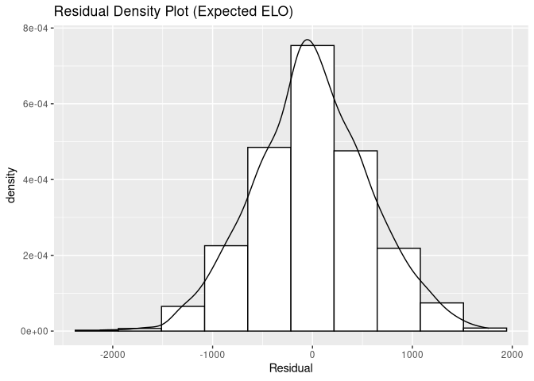
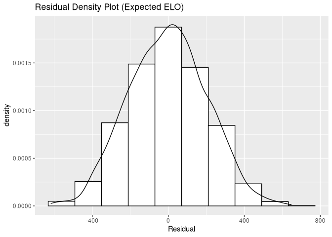

Results Analysis
================

First we will load the variables.

``` r
cat(res$alpha)
```

    ## 6.119124

``` r
cat(res$beta_home)
```

    ## 103.7534

``` r
cat(res$beta_away)
```

    ## 104.3989

``` r
cat(res$sigma_deficit)
```

    ## 32.01356

``` r
cat(res$beta_intercept)
```

    ## 0.08860122

We can see the most important statistics in order:

``` r
res$beta[order(res$beta, decreasing=T)]
```

    ##            Goal.Assists               Disposals   Contested.Possessions 
    ##               2.5982440               2.2307919               2.0528167 
    ##              Inside.50s         Marks.Inside.50                 Tackles 
    ##               1.8370303               1.6586528               1.5511784 
    ##                Rebounds          One.Percenters               Handballs 
    ##               1.2785337               1.2226626               1.1571124 
    ##                   Kicks                   Marks                Hit.Outs 
    ##               1.0865258               0.9136021               0.4473210 
    ##           Frees.Against                   Goals          Brownlow.Votes 
    ##               0.4117603               0.3497074               0.2005220 
    ##         Contested.Marks                 Bounces                   Frees 
    ##               0.1908005               0.1880500              -0.2344651 
    ##                Clangers                 Behinds              Clearances 
    ##              -1.5381203              -2.1669243              -3.6530080 
    ## Uncontested.Possessions 
    ##              -3.7388994

``` r
res$beta[order(abs(res$beta), decreasing=T)]
```

    ## Uncontested.Possessions              Clearances            Goal.Assists 
    ##              -3.7388994              -3.6530080               2.5982440 
    ##               Disposals                 Behinds   Contested.Possessions 
    ##               2.2307919              -2.1669243               2.0528167 
    ##              Inside.50s         Marks.Inside.50                 Tackles 
    ##               1.8370303               1.6586528               1.5511784 
    ##                Clangers                Rebounds          One.Percenters 
    ##              -1.5381203               1.2785337               1.2226626 
    ##               Handballs                   Kicks                   Marks 
    ##               1.1571124               1.0865258               0.9136021 
    ##                Hit.Outs           Frees.Against                   Goals 
    ##               0.4473210               0.4117603               0.3497074 
    ##                   Frees          Brownlow.Votes         Contested.Marks 
    ##              -0.2344651               0.2005220               0.1908005 
    ##                 Bounces 
    ##               0.1880500

Let us see who the best players are.

``` r
player_mean_data$score <- res$player_value_raw
players <- merge(players, player_mean_data[,c('playerId', 'score')])
players %>%
  arrange(desc(score)) %>%
  head(20)
```

    ##      playerId          displayName height weight         dob          position
    ## 1  2008822999         Rioli, Cyril    177     80 14-Jul-1989           Forward
    ## 2  2003874001        Waite, Jarrad    194     96  4-Feb-1983           Forward
    ## 3  2002665070       Buchanan, Amon    179     83 10-Oct-1982           Forward
    ## 4  2009835778         Sloane, Rory    182     83 17-Mar-1990          Midfield
    ## 5  2001823842       Riewoldt, Nick    193     92 17-Oct-1982           Forward
    ## 6  2007724084         Hawkins, Tom    198    103 21-Jul-1988           Forward
    ## 7  2006801835    Pendlebury, Scott    191     90  7-Jan-1988          Midfield
    ## 8  2004878702         Waters, Beau    188     87 30-Mar-1986          Defender
    ## 9  2007822538       Riewoldt, Jack    193     92 31-Oct-1988           Forward
    ## 10 2010664604      Barlow, Michael    189     91 18-Dec-1987 Midfield, Forward
    ## 11 2001801982         Petrie, Drew    197    101 15-Oct-1982           Forward
    ## 12 2005836583          Shaw, Heath    183     86 27-Nov-1985          Defender
    ## 13 2014665253  Bontempelli, Marcus    193     93 24-Nov-1995          Midfield
    ## 14 2007746814         Jack, Kieren    178     81 28-Jun-1987 Midfield, Forward
    ## 15 2011663064         Breust, Luke    184     84 11-Nov-1990           Forward
    ## 16 2013827893     Richards, Xavier    196     93 25-Apr-1993          Defender
    ## 17 2008681760 Dangerfield, Patrick    189     92  5-Apr-1990 Midfield, Forward
    ## 18 2005809838         Peake, Brett    186     86  5-Jul-1983          Midfield
    ## 19 2005682511       Deledio, Brett    188     88 18-Apr-1987 Midfield, Forward
    ## 20 2016799932      Oliver, Clayton    187     85 22-Jul-1997          Midfield
    ##                   origin player_idx    score
    ## 1               St Marys        917 15.59011
    ## 2     Murray Bushrangers        927 13.78532
    ## 3        Geelong Falcons       1412 13.59324
    ## 4         Eastern Ranges         32 13.38700
    ## 5              Southport       1024 13.37156
    ## 6      Melbourne Grammar        276 13.34782
    ## 7        Gippsland Power        136 12.69264
    ## 8          West Adelaide       1404 12.49018
    ## 9        Tassie Mariners        513 12.40327
    ## 10       Werribee Tigers        899 12.37092
    ## 11 North Ballarat Rebels       1037 12.30793
    ## 12      Northern Knights        722 12.13765
    ## 13      Northern Knights        634 11.71066
    ## 14          Nsw-act Rams        857 11.62337
    ## 15                Temora        337 11.58418
    ## 16   Sandringham Dragons       1137 11.55610
    ## 17       Geelong Falcons        270 11.52895
    ## 18        East Fremantle       1484 11.43160
    ## 19    Murray Bushrangers        824 11.42535
    ## 20    Murray Bushrangers        395 11.30026

We can also show the top 5 players by position:

``` r
players %>%
  group_by(position) %>%
  slice_max(order_by=score, n=5) %>%
  select(c(displayName, position, score)) %>%
  print(n=50)
```

    ## # A tibble: 42 × 3
    ## # Groups:   position [10]
    ##    displayName          position           score
    ##    <chr>                <chr>              <dbl>
    ##  1 Waters, Beau         Defender           12.5 
    ##  2 Shaw, Heath          Defender           12.1 
    ##  3 Richards, Xavier     Defender           11.6 
    ##  4 Taylor, Harry        Defender           11.2 
    ##  5 Rance, Alex          Defender           10.9 
    ##  6 Winderlich, Jason    Defender, Forward  11.0 
    ##  7 Adcock, Jed          Defender, Forward   9.82
    ##  8 Hooker, Cale         Defender, Forward   7.55
    ##  9 Burgoyne, Shaun      Defender, Forward   6.06
    ## 10 Duryea, Taylor       Defender, Forward   6.05
    ## 11 Bartel, Jimmy        Defender, Midfield 10.8 
    ## 12 Mayne, Chris         Defender, Midfield  9.09
    ## 13 Lewis, Jordan        Defender, Midfield  8.04
    ## 14 Goddard, Brendon     Defender, Midfield  6.76
    ## 15 Heppell, Dyson       Defender, Midfield  6.33
    ## 16 McEvoy, Ben          Defender, Ruck      5.10
    ## 17 Rioli, Cyril         Forward            15.6 
    ## 18 Waite, Jarrad        Forward            13.8 
    ## 19 Buchanan, Amon       Forward            13.6 
    ## 20 Riewoldt, Nick       Forward            13.4 
    ## 21 Hawkins, Tom         Forward            13.3 
    ## 22 Tippett, Kurt        Forward, Ruck       8.25
    ## 23 Pedersen, Cameron    Forward, Ruck       7.97
    ## 24 Lobb, Rory           Forward, Ruck       7.84
    ## 25 Lowden, Luke         Forward, Ruck       6.85
    ## 26 Hale, David          Forward, Ruck       6.56
    ## 27 Sloane, Rory         Midfield           13.4 
    ## 28 Pendlebury, Scott    Midfield           12.7 
    ## 29 Bontempelli, Marcus  Midfield           11.7 
    ## 30 Peake, Brett         Midfield           11.4 
    ## 31 Oliver, Clayton      Midfield           11.3 
    ## 32 Barlow, Michael      Midfield, Forward  12.4 
    ## 33 Jack, Kieren         Midfield, Forward  11.6 
    ## 34 Dangerfield, Patrick Midfield, Forward  11.5 
    ## 35 Deledio, Brett       Midfield, Forward  11.4 
    ## 36 Westhoff, Justin     Midfield, Forward  10.3 
    ## 37 Bruce, Cameron       Midfield, Ruck     -6.03
    ## 38 Mumford, Shane       Ruck                9.42
    ## 39 Naitanui, Nic        Ruck                8.93
    ## 40 McCauley, Broc       Ruck                8.32
    ## 41 Sandilands, Aaron    Ruck                6.11
    ## 42 Reeves, Ned          Ruck                5.59

We can now try and apply this to the games in our dataset.

``` r
ggplot(data.frame(Residual=stan_input$deficit-pred$deficits), aes(x=Residual)) +
  geom_histogram(aes(y=stat(density)), colour=1, fill="white", bins=10) +
  geom_density() +
  ggtitle("Residual Density Plot (Observed ELO)")
```

<!-- -->

``` r
ggplot(data.frame(Residual=stan_input$deficit-pred$deficits_expc), aes(x=Residual)) +
  geom_histogram(aes(y=stat(density)), colour=1, fill="white", bins=10) +
  geom_density() +
  ggtitle("Residual Density Plot (Expected ELO)")
```

<!-- -->

We can now try and apply this to compute win prediction accuracy.

``` r
game_wins <- as.numeric(stan_input$deficit>0)
print( sum(game_wins==pred$wins)/length(game_wins) )
```

    ## [1] 0.7238142

We can show the scores by origin:

``` r
players %>%
  group_by(origin) %>%
  summarise (avg_score = mean(score), n_players=n()) %>%
  arrange(desc(avg_score)) %>%
  head(10) %>%
  print
```

    ## # A tibble: 10 × 3
    ##    origin                                 avg_score n_players
    ##    <chr>                                      <dbl>     <int>
    ##  1 Melbourne Grammar                          13.3          1
    ##  2 Nsw-act Rams                               11.6          1
    ##  3 Mangoplah Cookardinia United Eastlakes     10.2          1
    ##  4 Broken Hill North                           9.65         1
    ##  5 NSW-ACT Under 18s                           9.05         1
    ##  6 Cardiff                                     8.62         1
    ##  7 Temora                                      7.90         2
    ##  8 Western                                     7.65         1
    ##  9 Perth Wildcats                              7.35         1
    ## 10 Subiaco Football Club                       7.13         1
